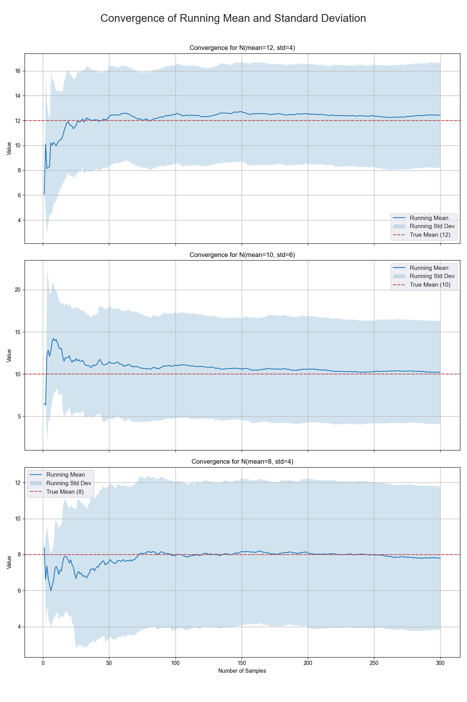
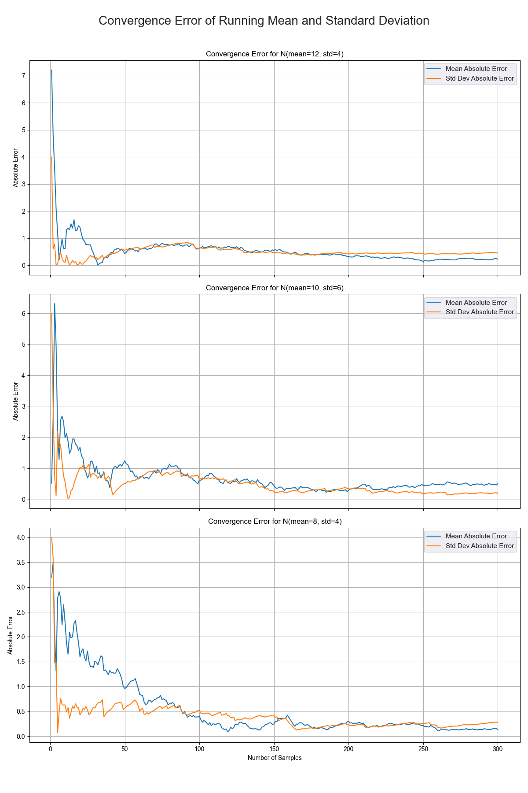
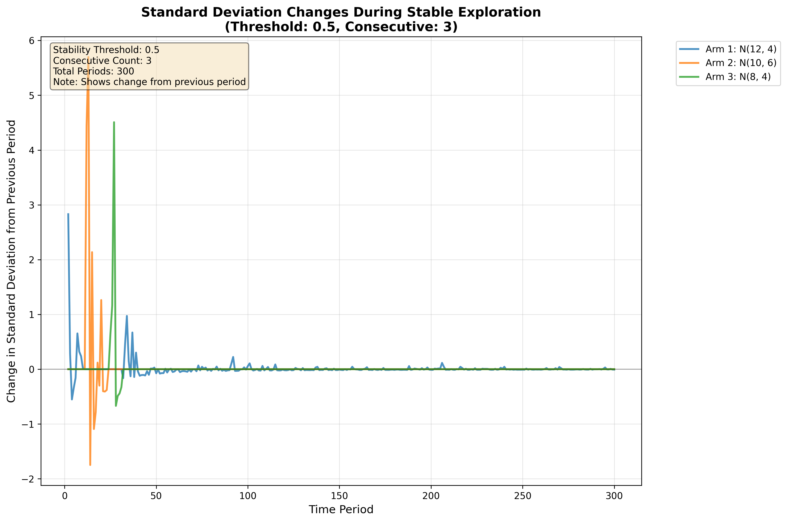

# Multi-Armed Bandit

<div align="center">

[](https://python.org)
[](https://tensorflow.org)
[](https://google.github.io/styleguide/pyguide.html)

_A comprehensive implementation and simulation framework for multi-armed bandit algorithms with neural network integration_



</div>

## Overview

This repository provides a robust, extensible framework for implementing, testing, and visualizing multi-armed bandit algorithms. It features four distinct algorithmic approaches, from classical strategies to modern neural network-based solutions, complete with Monte Carlo simulation capabilities and comprehensive visualization tools.

### Key Features

- **Four Algorithm Implementations**: Classical and modern approaches including neural network-based bandits
- **Monte Carlo Simulation Engine**: Robust statistical testing with configurable parameters
- **Rich Visualizations**: Professional plots showing convergence, errors, and algorithm behavior
- **Extensible Architecture**: Clean, modular design following OOP principles
- **Comprehensive Logging**: Detailed results tracking in JSON Lines format
- **High Performance**: Efficient implementations using NumPy and vectorized operations

## Algorithms

### 1. **Explore-Then-Exploit**

```python
# Simple two-phase strategy
Phase 1: Try each arm once (exploration)
Phase 2: Always choose the best arm found (exploitation)
```

### 2. **Epsilon-Greedy**

```python
# Balanced exploration-exploitation with randomization
if random() < epsilon:
    choose_random_arm()  # Explore
else:
    choose_best_arm()    # Exploit
```

### 3. **Stable Exploration**

```python
# Novel algorithm based on statistical stability
for each_arm:
    pull_until_std_deviation_stabilizes()
then:
    exploit_best_arm()
```

### 4. **Neural Bandit**

```python
# Deep learning approach using trained neural networks
state = [period, counts, rewards, std_devs]
action_probabilities = neural_network(state)
choose_arm_with_max_probability()
```

## Project Structure

```
multi_armed_bandits/
├── main.py                     # Main simulation runner
├── requirements.txt            # Dependencies
├── simulation_results.jsonl    # Logged results
│
├── img/                        # Generated visualizations
│   ├── all_distributions_error.png
│   ├── convergence.png
│   └── stable_std_evolution_single.png
│
├── model/                      # Trained neural network weights
│   └── bandit_nn_final.weights.h5
│
└── src/                        # Source code
    ├── simulation.py              # Monte Carlo simulation engine
    ├── train.py                   # Neural network training
    │
    ├── algorithms/             # Algorithm implementations
    │   ├── base.py               # Abstract base class
    │   ├── epsilon.py            # Epsilon-greedy algorithm
    │   ├── explore.py            # Explore-then-exploit
    │   ├── neural.py             # Neural network bandit
    │   └── stable.py             # Stable exploration
    │
    └── graphs/                 # Visualization modules
        ├── convergence.py        # Convergence plots
        ├── error.py             # Error analysis plots
        └── stable_std_evolution.py # Stability analysis
```

## Installation

### Prerequisites

- Python 3.8+
- pip package manager

### Quick Setup

```bash
# Clone the repository
git clone https://github.com/arvinduh/multi_armed_bandits.git
cd multi_armed_bandits

# Install dependencies
pip install -r requirements.txt
```

### Dependencies

```
numpy>=1.21.0          # Numerical computing
scipy>=1.7.0           # Statistical distributions
tensorflow>=2.8.0      # Neural network implementation
matplotlib>=3.5.0      # Plotting and visualization
seaborn>=0.11.0       # Enhanced statistical plots
absl-py>=1.0.0        # Command-line argument parsing
tqdm>=4.62.0          # Progress bars
```

## Quick Start

### Basic Usage

Run a simulation with the epsilon-greedy algorithm:

```bash
python main.py --model=epsilon_greedy --epsilon=0.1 --simulations=10000 --periods=300
```

### Command-Line Options

| Parameter               | Short | Default                            | Description                                                                                   |
| ----------------------- | ----- | ---------------------------------- | --------------------------------------------------------------------------------------------- |
| `--model`               | `-m`  | `neural_bandit`                    | Algorithm to use (`explore_exploit`, `epsilon_greedy`, `stable_exploration`, `neural_bandit`) |
| `--simulations`         | `-s`  | `10000`                            | Number of Monte Carlo simulations                                                             |
| `--periods`             | `-p`  | `300`                              | Time steps per simulation                                                                     |
| `--epsilon`             | `-e`  | `0.1`                              | Exploration rate for epsilon-greedy                                                           |
| `--distributions`       | `-d`  | `0`                                | Distribution set index (0 or 1)                                                               |
| `--stability_threshold` |       | `0.5`                              | Stability threshold for stable exploration                                                    |
| `--consecutive_count`   |       | `3`                                | Consecutive stable pulls needed                                                               |
| `--weights_path`        |       | `model/bandit_nn_final.weights.h5` | Path to neural network weights                                                                |

### Distribution Sets

**Set 0 (Default):**

- Arm 1: N(12, 4) - Highest mean, moderate variance
- Arm 2: N(10, 6) - Medium mean, highest variance
- Arm 3: N(8, 4) - Lowest mean, moderate variance

**Set 1:**

- Arm 1: N(18, 4) - Much higher mean, moderate variance
- Arm 2: N(8, 2) - Medium mean, low variance
- Arm 3: N(8, 1) - Medium mean, very low variance

## Example Runs

### Compare All Algorithms

```bash
# Explore-then-exploit
python main.py -m explore_exploit -s 10000 -p 300

# Epsilon-greedy with different exploration rates
python main.py -m epsilon_greedy -e 0.05 -s 10000
python main.py -m epsilon_greedy -e 0.1 -s 10000
python main.py -m epsilon_greedy -e 0.2 -s 10000

# Stable exploration with custom parameters
python main.py -m stable_exploration --stability_threshold=0.3 --consecutive_count=5

# Neural bandit (requires pre-trained model)
python main.py -m neural_bandit -s 1000  # Fewer sims due to computational cost
```

### Expected Output

```
--- Configuration ---
algorithm           Epsilon Greedy
epsilon             0.1
distributions       0 [N(12,4), N(10,6), N(8,4)]
periods             300
simulations         10000

--- Running ---
Running Simulations: 100%|████████████| 10000/10000 [00:32<00:00, 312.45it/s]

--- Completed ---
Average:            3514.48
Std Dev:            98.15

Results appended to simulation_results.jsonl
```

## Visualizations

### Generate Plots

**Convergence Analysis:**

```bash
cd src/graphs
python convergence.py  # Creates convergence.png
```

**Error Analysis:**

```bash
python error.py  # Creates all_distributions_error.png
```

**Stable Exploration Behavior:**

```bash
python stable_std_evolution.py  # Creates stability analysis plots
```

### Sample Visualizations


_Convergence error analysis showing how running statistics approach true values_


_Standard deviation changes during stable exploration algorithm_

## Training Neural Networks

Train a new neural network model:

```bash
cd src
python train.py --num_episodes=1000 --batch_size=128 --epsilon_start=1.0
```

### Training Parameters

| Parameter              | Default | Description                 |
| ---------------------- | ------- | --------------------------- |
| `--num_episodes`       | `1000`  | Number of training episodes |
| `--batch_size`         | `128`   | Training batch size         |
| `--epsilon_start`      | `1.0`   | Initial exploration rate    |
| `--epsilon_end`        | `0.01`  | Final exploration rate      |
| `--epsilon_decay_rate` | `0.995` | Decay rate per episode      |
| `--info_freq`          | `20`    | Display frequency           |
| `--checkpoint_freq`    | `100`   | Model saving frequency      |

## Algorithm Details

### Performance Characteristics

| Algorithm                | Exploration Strategy        | Exploitation Strategy     | Best For             |
| ------------------------ | --------------------------- | ------------------------- | -------------------- |
| **Explore-Then-Exploit** | Fixed initial phase         | Greedy selection          | Known time horizons  |
| **Epsilon-Greedy**       | Random with probability ε   | Greedy selection          | General-purpose      |
| **Stable Exploration**   | Statistical stability-based | Greedy selection          | Noisy environments   |
| **Neural Bandit**        | Learned exploration         | Neural network prediction | Complex state spaces |

### Theoretical Background

**Multi-Armed Bandit Problem:**

- **Goal:** Maximize cumulative reward over time
- **Challenge:** Balance exploration (learning) vs exploitation (earning)
- **Regret:** Difference between optimal and actual performance

**Key Metrics:**

- **Cumulative Reward:** Total reward across all time steps
- **Regret:** `T × μ* - Σ rewards`, where μ\* is the optimal arm's mean
- **Convergence Rate:** How quickly the algorithm identifies the best arm

## Results Analysis

### Simulation Results

Results are automatically logged to `simulation_results.jsonl`:

```json
{
  "timestamp": "2025-09-24T07:27:57.048704+00:00",
  "algorithm": "epsilon_greedy",
  "parameters": { "epsilon": 0.1 },
  "configuration": {
    "periods": 300,
    "num_simulations": 10000,
    "distribution_set": 0,
    "distributions": [
      [12, 4],
      [10, 6],
      [8, 4]
    ]
  },
  "results": {
    "mean_reward": 3514.48,
    "std_dev": 98.15
  }
}
```

### Performance Comparison

Based on empirical results with Distribution Set 0:

| Algorithm                  | Average Reward | Std Dev | Relative Performance |
| -------------------------- | -------------- | ------- | -------------------- |
| **Epsilon-Greedy (ε=0.1)** | 3,514.48       | 98.15   | **Best**             |
| **Stable Exploration**     | 3,423.12       | 258.10  | Good                 |
| **Explore-Then-Exploit**   | 3,220.96       | 429.97  | Moderate             |
| **Neural Bandit**          | 2,722.23\*     | 283.96  | Variable             |

\*Neural bandit performance depends on training quality and hyperparameters

## Extension Guide

### Adding New Algorithms

1. **Inherit from Base Class:**

```python
from src.algorithms.base import MultiArmAlgorithm

class MyAlgorithm(MultiArmAlgorithm):
    def select_arm(self) -> int:
        # Your selection logic here
        pass
```

2. **Register in Main:**

```python
# In main.py
elif FLAGS.model == "my_algorithm":
    model = MyAlgorithm(num_options=num_options)
```

### Custom Distributions

```python
# Add to DISTRIBUTION_SETS in main.py
from scipy.stats import beta, gamma

DISTRIBUTION_SETS = [
    [(12, 4), (10, 6), (8, 4)],  # Existing
    [(beta.rvs, (2, 5)), (gamma.rvs, (2,)), (norm.rvs, (0, 1))]  # Custom
]
```

## Contributing

We welcome contributions! Please follow these steps:

1. **Fork** the repository
2. **Create** a feature branch (`git checkout -b feature/amazing-feature`)
3. **Commit** your changes (`git commit -m 'Add amazing feature'`)
4. **Push** to the branch (`git push origin feature/amazing-feature`)
5. **Open** a Pull Request

### Development Guidelines

- Follow Google Python Style Guide
- Add docstrings to all functions and classes
- Include type hints for function parameters and returns
- Update documentation for new features

## Troubleshooting

### Common Issues

**Neural Network Model Not Found:**

```bash
# Train a new model first
cd src && python train.py --num_episodes=100
```

**Import Errors:**

```bash
# Ensure you're in the project root directory
cd multi_armed_bandits
python main.py --help
```

**Memory Issues with Large Simulations:**

```bash
# Reduce simulation count or periods
python main.py -s 1000 -p 100  # Instead of default 10,000 x 300
```

**Visualization Dependencies:**

```bash
# Install additional plotting libraries
pip install matplotlib seaborn
```

## Author

**Arvin Duh** -- [@arvinduh](https://github.com/arvinduh)
